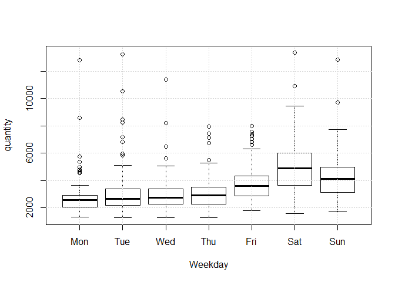
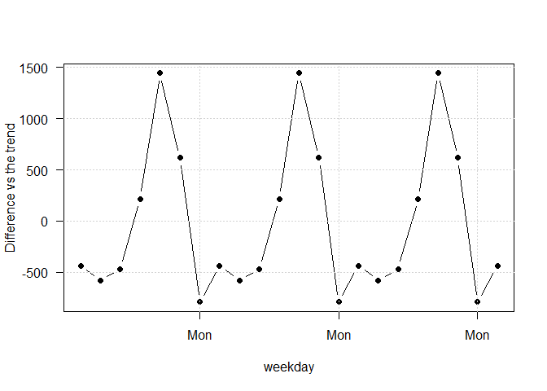
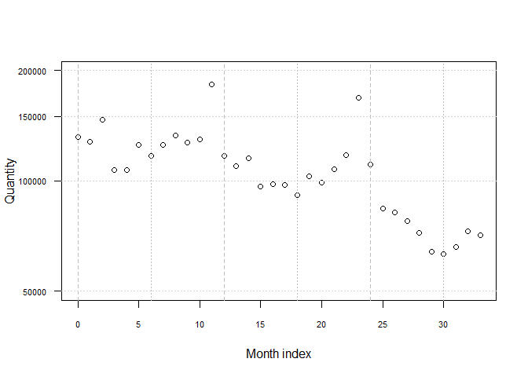
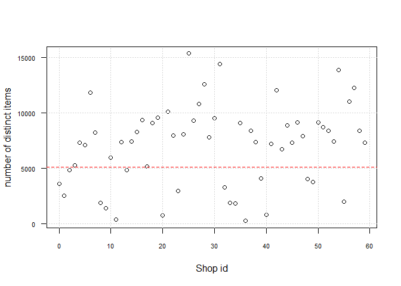

Predict Future Sales
================
Pep Porrà
March, 5th 2020

Read Data
---------

(<https://www.kaggle.com/c/competitive-data-science-predict-future-sales/overview>)

``` r
list.files("data/")
```

    ##  [1] "competitive-data-science-predict-future-sales.zip"
    ##  [2] "dataset_all.RData"                                
    ##  [3] "df_month.RData"                                   
    ##  [4] "item_categories.csv"                              
    ##  [5] "item_categories.RData"                            
    ##  [6] "items.csv"                                        
    ##  [7] "items.RData"                                      
    ##  [8] "sales_train.csv"                                  
    ##  [9] "sample_submission.csv"                            
    ## [10] "shops.csv"                                        
    ## [11] "shops.RData"                                      
    ## [12] "test.csv"                                         
    ## [13] "testset_all.RData"

Read in Russian item, category and shop descriptions

``` r
#Sys.setlocale()
Sys.setlocale(locale = "Russian")
```

    ## [1] "LC_COLLATE=Russian_Russia.1251;LC_CTYPE=Russian_Russia.1251;LC_MONETARY=Russian_Russia.1251;LC_NUMERIC=C;LC_TIME=Russian_Russia.1251"

``` r
Sys.setlocale(locale = "English")
```

    ## [1] "LC_COLLATE=English_United States.1252;LC_CTYPE=English_United States.1252;LC_MONETARY=English_United States.1252;LC_NUMERIC=C;LC_TIME=English_United States.1252"

``` r
#Sys.setlocale(locale = "")
```

``` r
load("data/dataset_all.RData")
load("data/testset_all.RData")
load("data/items.RData")
load("data/item_categories.RData")
load("data/shops.RData")
```

Features checks and properties
------------------------------

Check shop and item categories numbers. Test OK

``` r
length(unique(dataset_all$item_id)) == max(items$item_id) + 1
```

    ## [1] FALSE

``` r
length(unique(dataset_all$item_id)) <= max(items$item_id) + 1
```

    ## [1] TRUE

``` r
length(unique(dataset_all$item_category_id)) == max(item_categories$item_category_id) + 1
```

    ## [1] TRUE

``` r
length(unique(dataset_all$shop_id)) == max(shops$shop_id) + 1
```

    ## [1] TRUE

Less items in the train\_sales than in items. Probably there are items in the test set that do not exist in the train set (363). It will be challenging to forecast these products.

``` r
length(unique(testset_all$item_id))
```

    ## [1] 5100

``` r
length(unique(testset_all$shop_id))
```

    ## [1] 42

``` r
length(unique(testset_all$item_id)) * length(unique(testset_all$shop_id))
```

    ## [1] 214200

``` r
sum(!unique(testset_all$item_id) %in% unique(dataset_all$item_id) )
```

    ## [1] 363

``` r
sum(!items$item_id %in% unique(dataset_all$item_id))
```

    ## [1] 363

In the testset, all shops (42 in total) can sell the same total number of item types (5100). So the size of the testset is 2.14210^{5}.

check NA

``` r
sum(is.na(dataset_all))
```

    ## [1] 0

``` r
summary(dataset_all)
```

    ##     item_id      date_block_num     shop_id     item_price      
    ##  Min.   :    0   Min.   : 0.00   Min.   : 0   Min.   :    -1.0  
    ##  1st Qu.: 4476   1st Qu.: 7.00   1st Qu.:22   1st Qu.:   249.0  
    ##  Median : 9343   Median :14.00   Median :31   Median :   399.0  
    ##  Mean   :10197   Mean   :14.57   Mean   :33   Mean   :   890.9  
    ##  3rd Qu.:15684   3rd Qu.:23.00   3rd Qu.:47   3rd Qu.:   999.0  
    ##  Max.   :22169   Max.   :33.00   Max.   :59   Max.   :307980.0  
    ##   item_cnt_day           date             shop_item        
    ##  Min.   : -22.000   Min.   :2013-01-01   Length:2935849    
    ##  1st Qu.:   1.000   1st Qu.:2013-08-01   Class :character  
    ##  Median :   1.000   Median :2014-03-04   Mode  :character  
    ##  Mean   :   1.243   Mean   :2014-04-03                     
    ##  3rd Qu.:   1.000   3rd Qu.:2014-12-05                     
    ##  Max.   :2169.000   Max.   :2015-10-31                     
    ##  item_category_id
    ##  Min.   : 0      
    ##  1st Qu.:28      
    ##  Median :40      
    ##  Mean   :40      
    ##  3rd Qu.:55      
    ##  Max.   :83

Check if prices changed. Conclusion: prices can change probably by shop and/or date

``` r
vec_sd <- tapply(dataset_all$item_price, dataset_all$item_id, sd)
sum(is.na(vec_sd))
```

    ## [1] 2371

``` r
names(vec_sd) <- NULL
sum(vec_sd[!is.na(vec_sd)] <= 0.00000000000000000000001)
```

    ## [1] 3555

``` r
all.equal(tapply(dataset_all$item_price, dataset_all$item_id, sd), rep(0, 21807))
```

    ## [1] "names for target but not for current"                
    ## [2] "Attributes: < Modes: list, NULL >"                   
    ## [3] "Attributes: < Lengths: 2, 0 >"                       
    ## [4] "Attributes: < names for target but not for current >"
    ## [5] "Attributes: < current is not list-like >"            
    ## [6] "target is array, current is numeric"

Trend per day

``` r
q_by_day <- tapply(dataset_all$item_cnt_day, dataset_all$date, sum)
```

``` r
df_q_by_day <- data.frame(date = as.Date(names(q_by_day)), q = as.numeric(q_by_day))
plot(df_q_by_day$date, df_q_by_day$q, log = "y", typ = "l",
  las = 1, cex.axis = 0.7,
  ylab = "Quantity", xlab ="Day")
abline(v= seq.Date(from = as.Date("2013-01-01"), 
  to = as.Date("2015-10-31"), by = "3 month"), lty = c(2), col = "gray")
grid(nx = NA, ny = NULL)
```


weekly seasonality

``` r
plot(df_q_by_day$q ~ factor(weekdays(df_q_by_day$date, abbreviate = T),
  levels = c("Mon", "Tue", "Wed", "Thu", "Fri", "Sat", "Sun")),
  xlab = "Weekday", ylab = "quantity")
grid()
```


Q by Month

``` r
q_by_month <- tapply(dataset_all$item_cnt_day, dataset_all$date_block_num, sum)
```

``` r
df_q_by_month <- data.frame(month = 0:33, q = as.numeric(q_by_month))
plot(df_q_by_month$month, df_q_by_month$q, log = "y",
  las = 1, cex.axis = 0.7,
  ylab = "Quantity", xlab = "Month index")
abline(v= c(0, 6, 12, 18, 24, 30), lty = c(2, 3), col = "gray")
grid(nx = NA, ny = NULL)
```



Q by shop

``` r
q_by_shop <- tapply(dataset_all$item_cnt_day, dataset_all$shop_id, sum)
```

``` r
df_q_by_shop <- data.frame(shop = 0:59, q = as.numeric(q_by_shop))
plot(df_q_by_shop$shop, df_q_by_shop$q, log = "y", las = 1,
  ylab = "Quantity", xlab = "shop id", cex.axis = 0.7)
grid()
```



Number of different items sold by shop

``` r
unique_by_shop <- tapply(dataset_all$item_id, dataset_all$shop_id, function(x) length(unique(x)))
```

``` r
df_unique_by_shop <- data.frame(shop = 0:59, q = as.numeric(unique_by_shop))
plot(df_unique_by_shop$shop, df_unique_by_shop$q, las = 1,
  ylab = "number of distinct items", xlab = "Shop id", cex.axis = 0.7)
grid()
abline(h = 5100, col = "red", lty = 2)
```



``` r
sum(dataset_all$item_cnt_day == 0)
```

    ## [1] 0

We can assume all shops can sell the same items and that when the quantity is zero it is not registered.

Returns

``` r
sum(dataset_all$item_cnt_day < 0)
```

    ## [1] 7356

``` r
sum(dataset_all$item_cnt_day > 0)
```

    ## [1] 2928493

Sales by category

``` r
q_by_category <- tapply(dataset_all$item_cnt_day, dataset_all$item_category_id, sum)
```

``` r
df_q_by_category <- data.frame(category = 0:83, q = as.numeric(q_by_category))
plot(df_q_by_category$category, df_q_by_category$q, log = "y",
  ylab = "Quantity of items", xlab = "Category id", las = 1, cex.axis = 0.8)
grid()
```



Number of unique shops per month

``` r
unique_shops_by_month <- tapply(dataset_all$shop_id, dataset_all$date_block_num, 
  function(x) length(unique(x)))
```

``` r
df_unique_shops_by_month <- data.frame(month = 0:33, q = as.numeric(unique_shops_by_month))
plot(df_unique_shops_by_month$month, df_unique_shops_by_month$q,
  ylab = "Quantity of shops", xlab = "Month id", las = 1, cex.axis = 0.8,
  xlim = c(0, 34))
# Add shops in the test dataset
test_df <- data.frame(month = 34, q = length(unique(testset_all$shop_id)))
points(test_df$month, test_df$q, pch = 16, col = "red")
grid()
```


Is there any new shop in the test month?

``` r
sum(!unique(testset_all$shop_id) %in% unique(dataset_all[dataset_all$date_block_num == 33, ]$shop_id))
```

    ## [1] 0

All shops in the test month existed also in the month before. This is a test to run before using any model

Compute number of shops-items per month

``` r
unique_shop_item_by_month <- tapply(dataset_all$shop_item, dataset_all$date_block_num, 
  function(x) length(unique(x)))
```

``` r
df_unique_shop_item_by_month <- data.frame(month = 0:33, q = as.numeric(unique_shop_item_by_month))
plot(df_unique_shop_item_by_month$month, df_unique_shop_item_by_month$q,
  ylab = "Quantity of shops_item", xlab = "Month id", las = 1, cex.axis = 0.8,
  xlim = c(0, 34), ylim = c(0, 250000))
# Add shops in the test dataset
test_df <- data.frame(month = 34, q = nrow(testset_all))
points(test_df$month, test_df$q, pch = 16, col = "red")
grid()
```


Number of months active per shop

``` r
q_months_by_shop <- tapply(dataset_all$date_block_num, dataset_all$shop_id, 
  function(x) length(unique(x)))
```

``` r
df_q_months_by_shop <- data.frame(shop = 0:59, q = as.numeric(q_months_by_shop))
plot(df_q_months_by_shop$shop, df_q_months_by_shop$q,
  ylab = "Quantity of months active", xlab = "Shop id", las = 1, cex.axis = 0.8,
  xlim = c(0, 59))
# Add shops in the test dataset
test_df <- data.frame(shop = 0:59, q = (0:59) %in% unique(testset_all$shop_id))
points(df_q_months_by_shop[test_df$q, ]$shop, 
  df_q_months_by_shop[test_df$q, ]$q, pch = 16, col = "red")
grid()
legend("bottomright", legend = c("shop in the test set"), col = "red", pch = 16, cex = 0.7)
```


Shop with less than 34 months that are included in the testset

``` r
shops_in_set <- test_df[test_df$q, ]$shop
df_q_months_by_shop[
  (df_q_months_by_shop$shop %in% shops_in_set) & (df_q_months_by_shop$q <34), ]$shop
```

    ##  [1]  5 10 34 36 39 48 49 55 57 58

Model for a given month
-----------------------

Let us forecast month, where n between 0 and 33. We forget for a moment about daily and wekkly and monthly seasonalities. Our model is that in month n we will sell the same as in month n-1.

``` r
load("data/df_month.RData")
```

``` r
sum(df_month$item_cnt_day == 0)
```

    ## [1] 2583

``` r
sum(df_month$item_cnt_day > 0)
```

    ## [1] 1605626

``` r
sum(df_month$item_cnt_day < 0)
```

    ## [1] 915

``` r
max(df_month$item_cnt_day)
```

    ## [1] 2253

``` r
q_different <- table(df_month$item_cnt_day[df_month$item_cnt_day > 0])
```

``` r
head(q_different)
```

    ## 
    ##       1       2       3       4       5       6 
    ## 1058825  265502  103227   53327   31974   20731

``` r
tail(q_different)
```

    ## 
    ## 1127 1209 1242 1305 1644 2253 
    ##    1    1    1    1    2    1

``` r
df_month[df_month$item_cnt_day == max(df_month$item_cnt_day), ]
```

    ##       item_id date_block_num shop_id shop_item item_category_id
    ## 37931   11373             33      12  12_11373                9
    ##       item_cnt_day
    ## 37931         2253

``` r
range(q_different)
```

    ## [1]       1 1058825

``` r
range(df_month$item_cnt_day)
```

    ## [1]  -22 2253

``` r
plot(as.numeric(names(q_different)), q_different, log = "xy", ylim = c(1, 2e6),
  yaxt = "n",
  xlab = "Quantity of an item sold", ylab = "#items")
axis(2, at = 10^(0:6), labels = c(1, 10, 100, 1000, 10000, 100000, 1000000), las = 1)

fit_qq <- lm(log(q_different, 10) ~ log(as.numeric(names(q_different)), 10) )
abline(fit_qq, col = "red", lty = 2)
abline(h = c(1, 10, 100, 1000, 10000, 100000, 1000000),
  v = c(1, 5, 10, 50, 100, 500, 1000), lty = 3, col = "lightgray")
```


Explore intermediate months
---------------------------

``` r
month <- 23
month_set <- dataset_all[dataset_all$date_block_num == month, ]
all_combinations <- expand.grid(shops = unique(month_set$shop_id), item = unique(month_set$item_id))
```

``` r
cat("Distinct shop_item in month", month, ":", nrow(month_set), "\n")
```

    ## Distinct shop_item in month 23 : 130786

``` r
cat("potential shop_item in month", month, ":", nrow(all_combinations), "\n")
```

    ## potential shop_item in month 23 : 330250

``` r
all_shop_item_id <- paste(all_combinations$shops, all_combinations$item, sep = "_")
```

``` r
all_combinations$shop_item <- all_shop_item_id
all_combinations$q <- 0
# merge(dataset_all[dataset_all$date_block_num == month - 1, c("shop_item", "item_count_day")])
```

We could consider the dataset formed by all possibles items (22170), in all shops (60) and for all months (34) or days

``` r
22170 * 60
```

    ## [1] 1330200

This is the number of time series we want to forecast for the month Nov-2015. In October 2015, the total number of shop-items was

``` r
length(unique(df_month[ df_month$date_block_num == 33, ]$shop_item))
```

    ## [1] 31531

these are the values dictinct of zero. The total numbers shops-items would be

``` r
length(unique(df_month[ df_month$date_block_num == 33, ]$shop_id))
```

    ## [1] 44

``` r
length(unique(df_month[ df_month$date_block_num == 33, ]$item_id))
```

    ## [1] 5413

``` r
length(unique(df_month[ df_month$date_block_num == 33, ]$shop_id)) * 
  length(unique(df_month[ df_month$date_block_num == 33, ]$item_id))
```

    ## [1] 238172

In Nov-2015, we have 214200. Total number of shop\_item in month 34 that does not exist in month 33 are

``` r
sum(!unique(testset_all$shop_item) %in% unique(df_month[ df_month$date_block_num == 33, ]$shop_item))
```

    ## [1] 185520

But if we check shops first

``` r
cat("Distinct shops in month 33:", length(unique(testset_all$shop_id)), "\n")
```

    ## Distinct shops in month 33: 42

``` r
cat("Distinct shops in month 34:", 
  length(unique(df_month[ df_month$date_block_num == 33, ]$shop_id)), "\n")
```

    ## Distinct shops in month 34: 44

``` r
cat("Difference:", 
  sum(!unique(testset_all$shop_id) %in% unique(df_month[ df_month$date_block_num == 33, ]$shop_id)),
  "\n")
```

    ## Difference: 0

and items later

``` r
cat("Distinct items in month 33:", length(unique(testset_all$item_id)), "\n")
```

    ## Distinct items in month 33: 5100

``` r
cat("Distinct items in month 34:", 
  length(unique(df_month[ df_month$date_block_num == 33, ]$item_id)), "\n")
```

    ## Distinct items in month 34: 5413

``` r
cat("Difference:", 
  sum(!unique(testset_all$item_id) %in% unique(df_month[ df_month$date_block_num == 33, ]$item_id) ),
  "\n")
```

    ## Difference: 1109

``` r
5100 * 42
```

    ## [1] 214200

There are 1109 items which (we have to assume) have a quantity sold greater than 0 that were not sold the previous month. Let us check if this situation happens in previous months

``` r
items_not_in_previous_month <- function(n){
  stopifnot(n > 0 & n <= 34)
  ifelse(n == 34,
    items_n <- unique(testset_all$item_id),
    items_n <- unique(df_month[ df_month$date_block_num == n, ]$item_id))
  items_previous_month <- 
    unique(df_month[ df_month$date_block_num == n - 1, ]$item_id)
  difference <- !items_n %in% items_previous_month
  q <- sum(df_month[ 
    df_month$date_block_num == n &
    df_month$item_id %in% items_n[difference] , ]$item_cnt_day)
  return(c(sum(difference), q))
}
```

``` r
m_not_in_previous_month <- t(sapply(1:34, items_not_in_previous_month))
colnames(m_not_in_previous_month) <- c("#items", "q_sold")
m_not_in_previous_month
```

    ##       #items q_sold
    ##  [1,]   1237  22511
    ##  [2,]   1260  34563
    ##  [3,]   1175  17698
    ##  [4,]   1418  12708
    ##  [5,]   1461  18726
    ##  [6,]   1276   8753
    ##  [7,]   1306  17233
    ##  [8,]   1288  37150
    ##  [9,]   1603  24797
    ## [10,]   1589  29962
    ## [11,]   1768  24637
    ## [12,]   1031   4946
    ## [13,]   1348  10936
    ## [14,]   1473  18500
    ## [15,]   1360  18208
    ## [16,]   1391  16942
    ## [17,]   1392   9943
    ## [18,]   1387   9760
    ## [19,]   1190  11352
    ## [20,]   1147  22298
    ## [21,]   1460  20996
    ## [22,]   1364  32980
    ## [23,]   1501  20112
    ## [24,]    970   4276
    ## [25,]   1215   9092
    ## [26,]   1322  12125
    ## [27,]   1005  20312
    ## [28,]   1067  14863
    ## [29,]   1089   7559
    ## [30,]   1120   5317
    ## [31,]   1001   6336
    ## [32,]   1070  11705
    ## [33,]   1372  13780
    ## [34,]   1109      0

``` r
items_new <- function(n){
  stopifnot(n > 0 & n <= 34)
  ifelse(n == 34,
    items_n <- unique(testset_all$item_id),
    items_n <- unique(df_month[ df_month$date_block_num == n, ]$item_id))
  items_previous_month <- 
    unique(df_month[ df_month$date_block_num <= n - 1, ]$item_id)
  difference <- !items_n %in% items_previous_month
  q <- sum(df_month[ 
    df_month$date_block_num == n &
    df_month$item_id %in% items_n[difference] , ]$item_cnt_day)
  return(c(sum(difference), q))
}
```

Every month there are new items introduced. The forecast of these items is the challenging part of this problem Potentially we can separate the items in 3 categories: \* sold month before \* sold before but not the month before \* new items

``` r
m_new <- t(sapply(1:34, items_new))
colnames(m_new) <- c("#items", "q_sold")
m_new
```

    ##       #items q_sold
    ##  [1,]   1237  22511
    ##  [2,]    798  33717
    ##  [3,]    628  16630
    ##  [4,]    682  11484
    ##  [5,]    531  16610
    ##  [6,]    447   7103
    ##  [7,]    470  15594
    ##  [8,]    384  35656
    ##  [9,]    654  23045
    ## [10,]    489  28057
    ## [11,]    536  22002
    ## [12,]    207   3704
    ## [13,]    339   9401
    ## [14,]    310  16693
    ## [15,]    319  15911
    ## [16,]    262  15054
    ## [17,]    253   8264
    ## [18,]    316   7723
    ## [19,]    250   9540
    ## [20,]    330  21052
    ## [21,]    558  18490
    ## [22,]    460  31387
    ## [23,]    472  17722
    ## [24,]    197   2219
    ## [25,]    225   7073
    ## [26,]    336  10418
    ## [27,]    262  19149
    ## [28,]    225  13542
    ## [29,]    250   6308
    ## [30,]    206   3137
    ## [31,]    282   5139
    ## [32,]    302  10362
    ## [33,]    475  11287
    ## [34,]    363      0

``` r
items_month <- function(n){
  stopifnot(n >= 0 & n <= 34)
  ifelse(n == 34,
    items_n <- unique(testset_all$item_id),
    items_n <- unique(df_month[ df_month$date_block_num == n, ]$item_id))
  q <- sum(df_month[df_month$date_block_num == n, ]$item_cnt_day)
  return(c(length(items_n), q))
}
```

``` r
items_month(34)
```

    ## [1] 5100    0

``` r
m_items <- t(sapply(0:34, items_month))
colnames(m_items) <- c("#items", "q_sold")
m_items
```

    ##       #items q_sold
    ##  [1,]   8115 131479
    ##  [2,]   8168 128090
    ##  [3,]   8302 147142
    ##  [4,]   8145 107190
    ##  [5,]   8339 106970
    ##  [6,]   8478 125381
    ##  [7,]   8405 116966
    ##  [8,]   8031 125291
    ##  [9,]   7876 133332
    ## [10,]   8039 127541
    ## [11,]   8089 130009
    ## [12,]   8474 183342
    ## [13,]   7551 116899
    ## [14,]   7134 109687
    ## [15,]   7142 115297
    ## [16,]   6774  96556
    ## [17,]   6685  97790
    ## [18,]   6681  97429
    ## [19,]   6611  91280
    ## [20,]   6363 102721
    ## [21,]   6071  99208
    ## [22,]   6334 107422
    ## [23,]   6322 117845
    ## [24,]   6605 168755
    ## [25,]   6139 110971
    ## [26,]   6053  84198
    ## [27,]   6082  82014
    ## [28,]   5476  77827
    ## [29,]   5283  72295
    ## [30,]   5216  64114
    ## [31,]   5323  63187
    ## [32,]   5108  66079
    ## [33,]   5085  72843
    ## [34,]   5413  71056
    ## [35,]   5100      0

``` r
dates <- seq.Date(as.Date("2013-01-01"), as.Date("2015-11-01"), by = "month")
plot(dates, m_items[, 1], xlab = "Months",
  ylab = "Number of different references (items)", las = 1, xaxt = "n")
axis.Date(1, dates)
x_ticks = axis.Date(1, dates, labels = F)

grid(nx = NA, ny = NULL)
abline(v = x_ticks, col ="lightgray", lty = 3)
points(as.Date("2015-11-01"), m_items[35, 1], col = "red", pch = 16)
```


``` r
m_not_in_previous_month - m_new
```

    ##       #items q_sold
    ##  [1,]      0      0
    ##  [2,]    462    846
    ##  [3,]    547   1068
    ##  [4,]    736   1224
    ##  [5,]    930   2116
    ##  [6,]    829   1650
    ##  [7,]    836   1639
    ##  [8,]    904   1494
    ##  [9,]    949   1752
    ## [10,]   1100   1905
    ## [11,]   1232   2635
    ## [12,]    824   1242
    ## [13,]   1009   1535
    ## [14,]   1163   1807
    ## [15,]   1041   2297
    ## [16,]   1129   1888
    ## [17,]   1139   1679
    ## [18,]   1071   2037
    ## [19,]    940   1812
    ## [20,]    817   1246
    ## [21,]    902   2506
    ## [22,]    904   1593
    ## [23,]   1029   2390
    ## [24,]    773   2057
    ## [25,]    990   2019
    ## [26,]    986   1707
    ## [27,]    743   1163
    ## [28,]    842   1321
    ## [29,]    839   1251
    ## [30,]    914   2180
    ## [31,]    719   1197
    ## [32,]    768   1343
    ## [33,]    897   2493
    ## [34,]    746      0

``` r
items_in_previous_month <- function(n){
  stopifnot(n > 0 & n <= 34)
  ifelse(n == 34,
    items_n <- unique(testset_all$item_id),
    items_n <- unique(df_month[ df_month$date_block_num == n, ]$item_id))
  items_previous_month <- 
    unique(df_month[ df_month$date_block_num == n - 1, ]$item_id)
  difference <- items_n %in% items_previous_month
  q <- sum(df_month[ 
    df_month$date_block_num == n &
    df_month$item_id %in% items_n[difference] , ]$item_cnt_day)
  return(c(sum(difference), q))
}
```

``` r
m_in_previous_month <- t(sapply(1:34, items_in_previous_month))
colnames(m_in_previous_month) <- c("#items", "q_sold")
m_in_previous_month
```

    ##       #items q_sold
    ##  [1,]   6931 105579
    ##  [2,]   7042 112579
    ##  [3,]   6970  89492
    ##  [4,]   6921  94262
    ##  [5,]   7017 106655
    ##  [6,]   7129 108213
    ##  [7,]   6725 108058
    ##  [8,]   6588  96182
    ##  [9,]   6436 102744
    ## [10,]   6500 100047
    ## [11,]   6706 158705
    ## [12,]   6520 111953
    ## [13,]   5786  98751
    ## [14,]   5669  96797
    ## [15,]   5414  78348
    ## [16,]   5294  80848
    ## [17,]   5289  87486
    ## [18,]   5224  81520
    ## [19,]   5173  91369
    ## [20,]   4924  76910
    ## [21,]   4874  86426
    ## [22,]   4958  84865
    ## [23,]   5104 148643
    ## [24,]   5169 106695
    ## [25,]   4838  75106
    ## [26,]   4760  69889
    ## [27,]   4471  57515
    ## [28,]   4216  57432
    ## [29,]   4127  56555
    ## [30,]   4203  57870
    ## [31,]   4107  59743
    ## [32,]   4015  61138
    ## [33,]   4041  57276
    ## [34,]   3991      0

``` r
m_not_in_previous_month + m_in_previous_month
```

    ##       #items q_sold
    ##  [1,]   8168 128090
    ##  [2,]   8302 147142
    ##  [3,]   8145 107190
    ##  [4,]   8339 106970
    ##  [5,]   8478 125381
    ##  [6,]   8405 116966
    ##  [7,]   8031 125291
    ##  [8,]   7876 133332
    ##  [9,]   8039 127541
    ## [10,]   8089 130009
    ## [11,]   8474 183342
    ## [12,]   7551 116899
    ## [13,]   7134 109687
    ## [14,]   7142 115297
    ## [15,]   6774  96556
    ## [16,]   6685  97790
    ## [17,]   6681  97429
    ## [18,]   6611  91280
    ## [19,]   6363 102721
    ## [20,]   6071  99208
    ## [21,]   6334 107422
    ## [22,]   6322 117845
    ## [23,]   6605 168755
    ## [24,]   6139 110971
    ## [25,]   6053  84198
    ## [26,]   6082  82014
    ## [27,]   5476  77827
    ## [28,]   5283  72295
    ## [29,]   5216  64114
    ## [30,]   5323  63187
    ## [31,]   5108  66079
    ## [32,]   5085  72843
    ## [33,]   5413  71056
    ## [34,]   5100      0

``` r
sum(m_items[-1, ] != m_in_previous_month + (m_not_in_previous_month - m_new) + m_new)
```

    ## [1] 0

``` r
month <- 23
cat("items in month (", month, "):", m_items[month + 1, ], "\n")
```

    ## items in month ( 23 ): 6605 168755

``` r
cat("items in previous month (", month - 1, "):", m_in_previous_month[month, ], "\n")
```

    ## items in previous month ( 22 ): 5104 148643

``` r
cat("items not in previous month (", month - 1, ") but in some month before:", 
  m_not_in_previous_month[month, ] - m_new[month, ], "\n")
```

    ## items not in previous month ( 22 ) but in some month before: 1029 2390

``` r
cat("items new in month (", month , "):", m_new[month, ], "\n")
```

    ## items new in month ( 23 ): 472 17722
